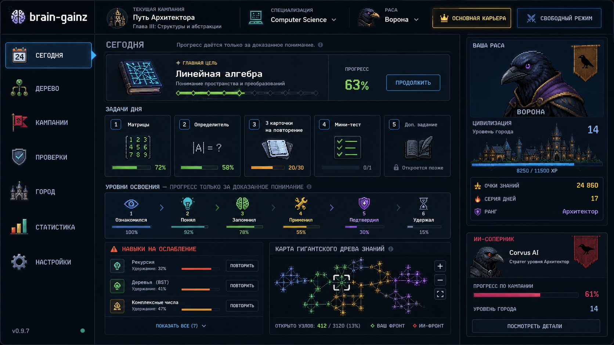

# Visual Reference: Strategy Dashboard

Reference image:

## What This Reference Captures

This image is a strong direction for BrainGainz as a strategic learning game, not a generic education dashboard.

Use it as a reference for:
- dark command-center mood
- pixel-art / retro strategy-game styling
- race identity as a persistent right-side presence
- city growth as visible reward
- AI opponent as visible pressure
- `Today` as a mission control screen
- knowledge map as strategic territory
- mastery levels as compact visual progression
- short action cards instead of long instructions

## Screen Structure

The layout has five useful zones:

1. Top bar:
   - current campaign
   - specialization
   - race
   - mode switch

2. Left navigation:
   - large icon-led sections
   - short labels
   - clear active state

3. Center work area:
   - main objective
   - daily tasks
   - mastery progress
   - weakening skills
   - mini knowledge map

4. Right player panel:
   - race portrait
   - banner / emblem
   - city preview
   - XP / rank / streak

5. Right opponent panel:
   - opponent portrait
   - campaign progress
   - city level
   - details action

## Visual Language

Good patterns to keep:
- high-contrast dark blue / black base
- cyan outlines for neutral UI
- gold for primary career / victory / important actions
- green for progress and learned content
- red / pink for opponent and danger
- purple for rank, confirmation, or advanced mastery
- pixel-art icons and portraits
- compact rectangular panels with thin borders
- glow only for active selection and key state

Avoid copying too literally:
- too many panels with equal visual weight
- too much small text
- too many permanent numbers
- baked-in text inside generated art
- fixed desktop-only density

## UX Principles From The Reference

The main screen should answer in a few seconds:
- who am I playing as?
- which campaign and specialization are active?
- what is my next learning action?
- what is weakening?
- how is my city/race growing?
- is the opponent ahead or behind?

The interface should not explain the product with paragraphs. It should show state through visual hierarchy.

## Asset Notes

Useful generated asset families based on this reference:
- crow race portrait
- race banner / emblem
- city skyline strip
- opponent crow portrait
- node task icons
- mastery level icons
- specialization icons
- knowledge-map node sprites
- panel textures

Generated images must not include required UI text. Text should be rendered by the app for localization, readability, and consistency.

## Implementation Guardrails

- Treat this as art direction, not a pixel-perfect layout.
- Build responsive versions before freezing panel density.
- Keep primary next action visually dominant.
- Test every generated asset at its real in-app size.
- If the screen starts feeling like a settings dashboard, reduce text and increase visual state.
